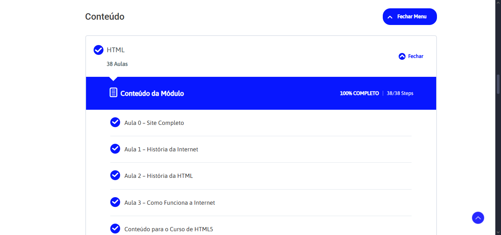
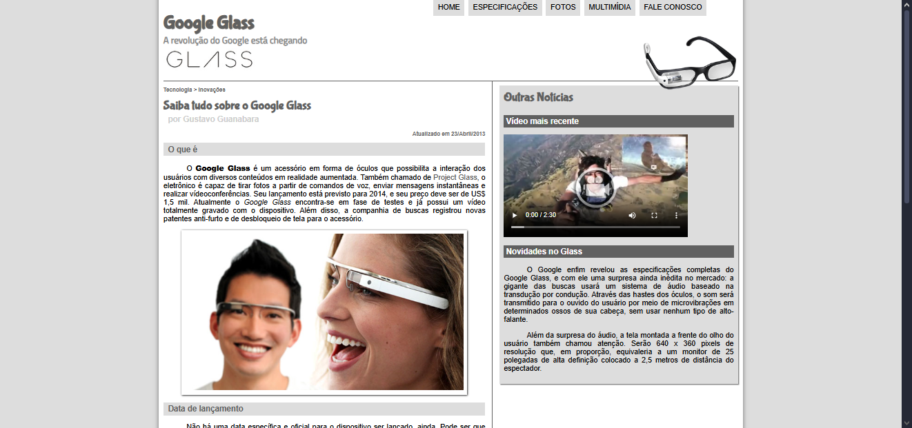

# 📌 Projeto Google Glass

Projeto antigo, mas que me ajudou muito: Google Glass HTML5, fruto do curso de HTML5 do Curso em Vídeo.
Foi minha introdução à web, onde aprendi a estruturar páginas com HTML semântico, estilizar visualmente com CSS, e controlar assets visuais modernos como imagens, fontes e efeitos de sombra.

---

## 🔗 Acesso ao projeto

[🔗 Clique aqui para acessar](https://github.com/Luis-hans/projeto-glass-html5)

---

## 🎯 Funcionalidades

- [x] Efeitos de sombra.
- [x] Efeito de zoom nas fotos.
- [x] Multiplas páginas.

---

## 🖼️ Preview




---

## 🚀 Tecnologias utilizadas

- HTML.
- CSS.
- JavaScript.

---

## ⚙️ Como usar

```bash
# Clone o repositório
git clone Luis-hans/projeto-glass-html5

# Acesse a pasta do projeto
cd projeto-glass-html5

# Abra o arquivo index.html no navegador
```

---

## 📚 Aprendizados

- HTML semânico.
- CSS3

---

## 🧾 Licença

Este projeto está sob a licença MIT. Sinta-se à vontade para usar, modificar e compartilhar!

---

## 🤝 Contato

Feito por Luís Henrique  
📬 luishenrique.lhans@gmail.com  
🐙 Luis-hans
